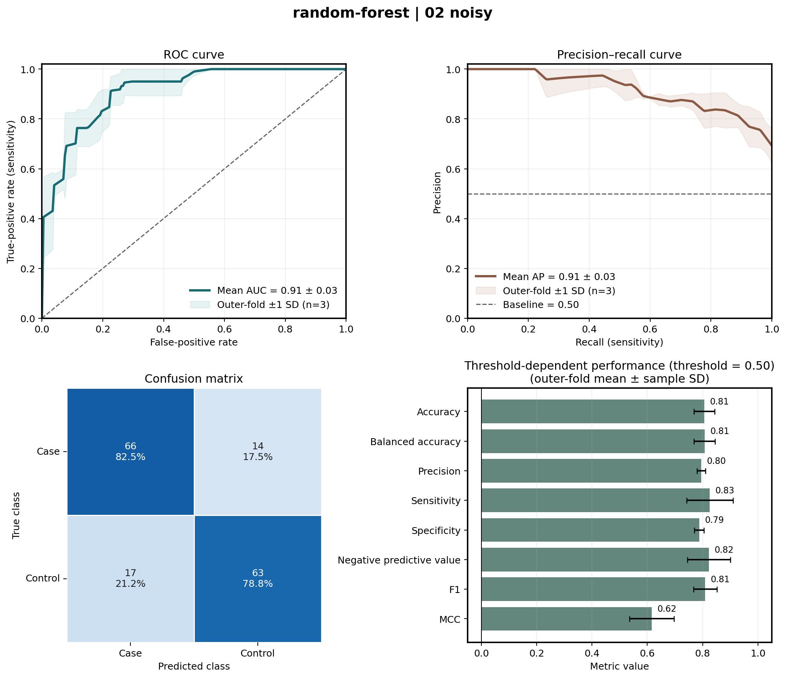
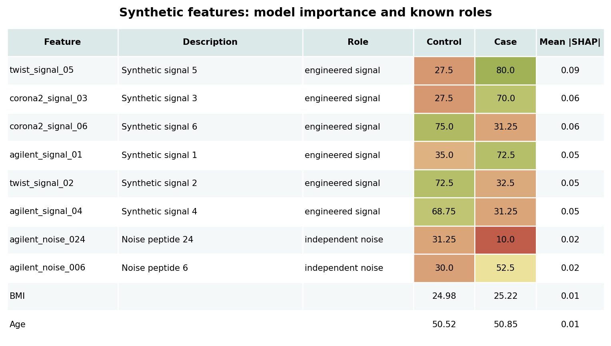
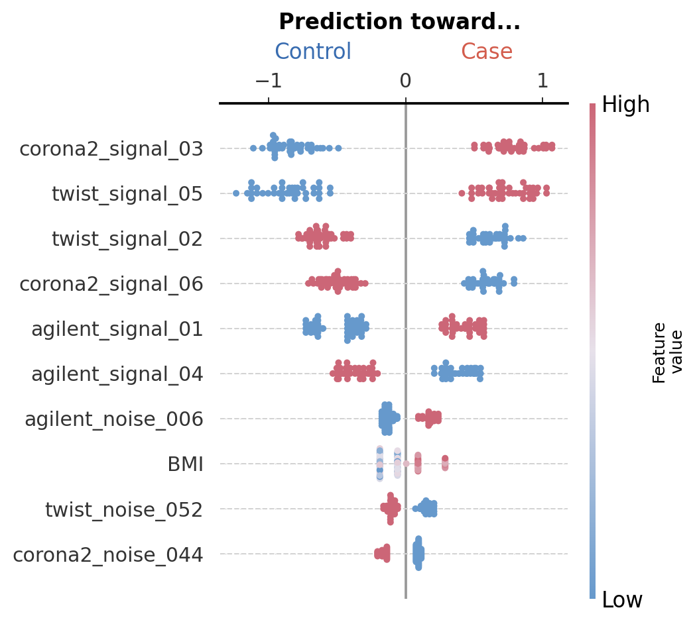

# phipml: from peptide data to model interpretation

**A runnable tutorial for Random Forest, XGBoost, nested cross-validation,
external validation, and publication-ready plots.**

Built against phipml **4.2.0**, commit
[`932f14f`](https://github.com/csReynaB/phipml/tree/932f14ffca41ba4f24f3cc570afea27265a5893c),
inspected on **8 September 2026**. The commands below use the implemented
configuration schema and were run on the supplied synthetic data.

You will start with peptide and sample metadata CSVs, fit either estimator,
compare fixed/default and tuned models, evaluate an independent synthetic
cohort, and produce ROC, precision–recall, classification, SHAP, and annotated
feature plots. Finished results are included so you can inspect them before
rerunning anything.

> **Start here:** follow sections 1–6 for your first model and plots. Then run
> the six scenarios, compare the results, and use the references when adapting
> your own configuration. For a workshop, start with Random Forest and add
> XGBoost after the workflow is familiar.

## What is included

| Item | Location |
|---|---|
| This walkthrough | `README.md` |
| Every model-config argument | [docs/MODEL_CONFIG.md](docs/MODEL_CONFIG.md) |
| Shared selector, RF and XGBoost hyperparameters | [docs/HYPERPARAMETERS.md](docs/HYPERPARAMETERS.md) |
| Every plot-config argument and heatmap command | [docs/PLOTTING_CONFIG.md](docs/PLOTTING_CONFIG.md) |
| Observed results and verification notes | [reports/REFERENCE_RUN.md](reports/REFERENCE_RUN.md) |
| Deterministic mock-data/config generator | `scripts/generate_examples.py` |
| Twelve ready-to-run model recipes | `configs/models/{random-forest,xgboost}/01...06*.yaml` |
| Corresponding plot recipes | `configs/plots/{random-forest,xgboost}/` |
| CSV data, metadata, annotations, data hashes | `data/` |
| Fitted models, predictions, and metrics | `results/`, `reports/` |
| Actual plots, in PDF/SVG/PNG | `plots/` |
| One-command workflow and repeated-run example | `scripts/run_all.sh`, `scripts/run_repeated.sh` |

The tutorial is a standalone folder. It can also be added under
`tutorials/from_data_to_plots/` in the phipml repository: relative paths inside
the folder continue to work. Run its commands from that folder. It does not
require changes to phipml's source.

## 1. Install phipml

### Recommended: the repository's Micromamba environment

Use Linux/macOS, or an equivalent Bash environment. Install Git and Micromamba
first if needed; platform setup and Docker/Apptainer alternatives are in the
repository's
[installation guide](https://github.com/csReynaB/phipml/blob/932f14ffca41ba4f24f3cc570afea27265a5893c/INSTALLATION.md).

```bash
git clone https://github.com/csReynaB/phipml.git
cd phipml

# Pin the source used by this tutorial. This is a local checkout only.
git checkout 932f14ffca41ba4f24f3cc570afea27265a5893c

micromamba create --yes --name phipml --file ML_env.yml
micromamba activate phipml
python -m pip install --no-build-isolation --no-deps -e .

phipml --version
phipml -h
phipml-plot -h
phipml-heatmap -h
```

`ML_env.yml` supplies the tested scientific package pins with Python 3.10.16.
`--no-deps` prevents pip from replacing those packages. `-e` links the installed
package to the cloned source, so retain the checkout.

### Alternative: pip in a virtual environment

In the same pinned repository checkout, use an installed Python 3.10–3.12:

```bash
python3 -m venv .venv
source .venv/bin/activate
python -m pip install --upgrade pip
python -m pip install .
phipml --version
```

Although the package declares Python >=3.10, its dependency upper bounds make
3.10–3.12 the practical choices for this tutorial; do not assume every newer
Python can resolve the pinned scientific stack. Pip resolves compatible ranges
and can choose versions different from `ML_env.yml`. The included run used
Python 3.12.13, sklearn 1.5.2, XGBoost 2.1.4, and SHAP 0.46.0; exact package
versions are recorded in `reports/requirements-reference.txt`.

The virtual environment must remain active while running the tutorial. The
small examples use CPU execution; no GPU is required.

### Open the tutorial folder

Extract `phipml-tutorial-932f14f.zip` and enter the extracted folder. For example,
if your downloaded archive is in the current directory:

```bash
unzip phipml-tutorial-932f14f.zip
cd phipml-tutorial-932f14f
```

All commands below assume this directory. Data/config files are already
included. To recreate them deterministically:

```bash
python scripts/generate_examples.py
```

The generator rewrites its example data/configs with the documented defaults;
copy a config before customizing it. It does not delete old results. If you
change `--data-seed` or `--n-iter`, keep a separate tutorial copy/output directory
so old artifacts cannot be mistaken for the new experiment.

## 2. Understand the example data

There are two datasets, **perfect** and **noisy**. Each includes 160 training
samples and 80 independent external samples, with balanced Control/Case labels.
Every sample has 80 binary peptide measurements; four numeric clinical
predictors are supplied through metadata.

| File | Rows represent | Required identifiers/content |
|---|---|---|
| `data/noisy/peptides.csv` | Samples | First column `SampleName`; remaining columns are named peptides containing 0/1. |
| `data/noisy/metadata.csv` | Samples | `SampleName`, `group_test`, `cohort`, `Sex`, `Smoking`, `Age`, `BMI`. |
| `data/peptide_library.csv` | Peptides | `peptide_id`, `Description`, `Role`, `Species`, `Protein`, `is_demo_signal`. Used for annotation, not as predictor columns. |

The matching files under `data/perfect/` have the same schema. Inspect the
actual data with:

```bash
python - <<'PY'
import pandas as pd
X = pd.read_csv("data/noisy/peptides.csv", index_col=0)
metadata = pd.read_csv("data/noisy/metadata.csv").set_index("SampleName")
print("Peptide matrix:", X.shape)
print(X.iloc[:4, :6])
print(metadata.head(4))
print(pd.crosstab(metadata["cohort"], metadata["group_test"]))
assert X.index.is_unique and metadata.index.is_unique
assert set(X.index) == set(metadata.index)
PY
```

Expected counts:

| Cohort | Control | Case | Total |
|---|---:|---:|---:|
| training | 80 | 80 | 160 |
| external | 40 | 40 | 80 |

`group_tests: [Control, Case]` encodes Control=0 and Case=1. `cohort` selects
training/external rows and is not included in the predictor matrix. The model
receives 80 peptides plus the four configured extras: 84 features before
pipeline feature selection.

### What “perfect” and “noisy” mean

In the perfect data, six engineered peptides exactly encode the label or its
inverse. This is an intentional software demonstration. The remaining 74
peptides and clinical features are independent of class in the data-generating
process. Correlated perfect peptides can share model importance unevenly.

In the noisy data, six peptides have class-dependent presence probabilities:
0.70 versus 0.30 in training, and 0.65 versus 0.35 externally, with alternating
directions. The external relationship is deliberately slightly weaker. The
external age distribution is also shifted by four years, independently of
class. There is **no promise that tuning improves the result**.

The generator draws training and external samples independently. Default and
tuned runs reuse exactly the same input files and model seed. Synthetic
annotations identify the intended signal/noise roles; they are not real taxa
or biomarkers. `data/generation_manifest.json` records the generation settings
and SHA-256 hashes.

### Matrix orientation

The tutorial uses **sample rows × peptide columns** with `transposed: false`.
For a peptide-row matrix, use `transposed: true`. Equivalent
`peptides_transposed.csv` files are included for illustration. The first column
must contain the relevant row identifiers in either orientation.

## 3. Read the first model config

Open `configs/models/random-forest/01_perfect.yaml`. The main decisions are:

```yaml
# Paths below are relative to configs/models/random-forest/.
data_input: ../../../data/perfect/peptides.csv
metadata_input: ../../../data/perfect/metadata.csv
data_input_mode: matrix
transposed: false

col_sample_name: SampleName
col_target: group_test
group_tests: [Control, Case]
peptide_prefixes: [agilent_, twist_, corona2_]
extra_features_to_include: [Sex, Smoking, Age, BMI]
fillna_value: null

lib_metadata_input: ../../../data/peptide_library.csv
lib_col_peptide_name: peptide_id
random_state: 420

classification:
  model_type: random-forest
  param_grid_name: random-forest
  seed: 420
  train_filters: {cohort: training}
  run_nested_cv: true
  only_train_model: true
  use_pretrained: false
  with_oligos: true
  with_additional_features: true
  prevalence_threshold_min: 0
  prevalence_threshold_max: 100
  outer_cv_splits: 3
  inner_cv_splits: 2
  n_iter: 1
  n_jobs_outer: 1
  n_jobs_inner: 1
  classification_threshold: 0.5
  validation_sets: []
  output_dir: ../../../results/random-forest/01_perfect
  output_name: 01_perfect

param_grid: {}
```

This is a complete minimal working configuration; the supplied file spells out
additional options documented in [the model reference](docs/MODEL_CONFIG.md).

`param_grid: {}` means no hyperparameter search. Constant-feature removal and
elastic-net peptide selection still fit inside each training pipeline.
`run_nested_cv: true` requests outer-CV evaluation; with an empty grid there is
no inner tuning. `only_train_model: true` then saves a model fitted on the whole
training cohort and skips external validation.

External rows are present in the input files but excluded from all training
and tuning by `train_filters: {cohort: training}`.

## 4. Fit a Random Forest and locate the outputs

```bash
phipml -c configs/models/random-forest/01_perfect.yaml
```

The log should report `samples=160, features=84`. This run creates:

| Output under `results/random-forest/01_perfect/` | Use |
|---|---|
| `nested_random-forest_01_perfect_420.joblib` | Held-out outer-CV predictions, metrics, SHAP, selected features, and fold models. Use this to plot internal performance. |
| `training_random-forest_01_perfect_420.joblib` | Pipeline refitted on all training samples. Use this for later prediction/external validation. |

Filename pattern:
`{nested|training}_{model_type}_{output_name}_{seed}.joblib`.
Running the same configuration/seed again replaces the same filenames.

## 5. Generate the first plots

```bash
phipml-plot --plot-config configs/plots/random-forest/01_perfect.yaml
```

Open `plots/random-forest/01_perfect/01_perfect_performance.png`. It should show
near-perfect discrimination because the data were constructed to be perfectly
separable. The plotting recipe produces nine figure types in PDF, SVG, and PNG,
plus a detailed feature-importance CSV.

The essential plotting fields are:

```yaml
plotting:
  results:
    - ../../../results/random-forest/01_perfect/nested_random-forest_01_perfect_420.joblib
  config: ../../models/random-forest/01_perfect.yaml
  split: train
  plots: [all]
  formats: [pdf, svg, png]
  dpi: 180
  output_dir: ../../../plots/random-forest/01_perfect
  output_prefix: 01_perfect
  class_labels: [Control, Case]
  max_display: 10
  library_metadata: ../../../data/peptide_library.csv
  library_id_column: peptide_id
```

`--plot-config` reads the plotting recipe; its `config:` entry points to the
model/data YAML. `split: train` refers to the training cohort's **out-of-fold**
predictions. Use `split: test` for an external validation artifact. The separate
`training_...joblib` file is not an evaluation result to plot.

See [the plotting reference](docs/PLOTTING_CONFIG.md) for all fields, colors,
annotation controls, feature ranking, and standalone-panel commands.

## 6. Move to noisy data, then tune

```bash
# Identical schema, imperfect signal, default hyperparameters.
phipml -c configs/models/random-forest/02_noisy.yaml
phipml-plot --plot-config configs/plots/random-forest/02_noisy.yaml

# The same noisy samples and seed, with inner-CV hyperparameter search.
phipml -c configs/models/random-forest/03_noisy_tuned.yaml
phipml-plot --plot-config configs/plots/random-forest/03_noisy_tuned.yaml
```

The tuned YAML adds search spaces beneath `param_grid.random-forest` and sets
`n_iter: 12`. It searches the peptide selector's regularization, forest tree
count/depth, split/leaf sizes, feature subsampling, and class weighting.
All candidate comparisons happen in training folds. The held-out outer samples
are evaluated only after a candidate has been selected.

For example, increasing `min_samples_leaf` makes leaves depend on more samples
and generally smooths predictions; increasing selector `C` weakens
regularization. Those are different parts of the pipeline. The
[hyperparameter guide](docs/HYPERPARAMETERS.md) explains every search parameter,
the direction of its effect, and the exact YAML syntax.

### What a real noisy result looks like



This figure is generated by the command above. ROC/PR summarize outer-fold
performance. The confusion matrix pools held-out predictions. The classification
bars in this version use outer-fold means and variability when present; these
can differ slightly from metrics recomputed on all pooled predictions.

### Interpret the learned features



The highest-ranked peptides largely recover the engineered signal in this
example. Noise peptides and clinical variables can still receive nonzero
importance. Class-wise prevalence/means and SHAP importance answer different
questions: prevalence describes the samples; SHAP explains the fitted model.
The CSV also includes column types and statistic labels omitted from the compact
figure. Here peptide values are percentages and Age/BMI entries are means in
their original units.

## 7. Evaluate the external cohort

Use `run_nested_cv: false`, `only_train_model: false`, and add the validation
cohort. Each model is fitted/tuned using the training rows and then evaluated
on the 80 independent external samples.

```yaml
classification:
  train_filters: {cohort: training}
  run_nested_cv: false
  only_train_model: false
  validation_sets:
    - name: 05_external_noisy
      filters: {cohort: external}
  classification_threshold: 0.5
  bootstrap_validation: true
  bootstrap_n_resamples: 500
  bootstrap_confidence_level: 0.95
```

The fragment illustrates the change; run the complete supplied files:

```bash
phipml -c configs/models/random-forest/04_external_perfect.yaml
phipml-plot --plot-config configs/plots/random-forest/04_external_perfect.yaml

phipml -c configs/models/random-forest/05_external_noisy.yaml
phipml-plot --plot-config configs/plots/random-forest/05_external_noisy.yaml

phipml -c configs/models/random-forest/06_external_noisy_tuned.yaml
phipml-plot --plot-config configs/plots/random-forest/06_external_noisy_tuned.yaml
```

For example, the noisy external artifact is
`results/random-forest/05_external_noisy/validation_random-forest_05_external_noisy_420.joblib`.
Its name comes from the validation set's `name`, not `output_name`.

The current CLI selects cohorts from shared input files. Separate per-validation
matrix/metadata paths are not implemented in `validation_sets` at this commit.
For new files, see [external-input guidance](docs/MODEL_CONFIG.md).

## 8. Run the same six scenarios with XGBoost

Use the XGBoost configurations supplied alongside Random Forest:

```bash
for scenario in 01_perfect 02_noisy 03_noisy_tuned 04_external_perfect 05_external_noisy 06_external_noisy_tuned; do
  phipml -c "configs/models/xgboost/$scenario.yaml"
  phipml-plot --plot-config "configs/plots/xgboost/$scenario.yaml"
done
```

The input/cohort definitions stay the same. XGBoost tuning instead searches
tree count, learning rate, depth, child weight, row/column subsampling, and
leaf/split regularization, along with the shared peptide selector.



Each dot is one external sample. Red/blue show high/low feature values;
left/right show contributions away from/toward Case. XGBoost's SHAP values here
are raw-margin/log-odds contributions, not probability-point differences.
Mean absolute SHAP can rank features but does not give direction, statistical
significance, or a causal interpretation.

## 9. One command for all scenarios

After installation, from the tutorial directory:

```bash
# Six models, all plots, heatmaps, and a metric/prediction export.
bash scripts/run_all.sh random-forest

# Or use XGBoost.
bash scripts/run_all.sh xgboost

# Or run all twelve estimator/scenario combinations.
bash scripts/run_all.sh both
```

| Scenario | What it evaluates | Tuning? | Evaluation samples |
|---|---|---|---:|
| `01_perfect` | Strong, engineered signal via outer CV | No | 160 |
| `02_noisy` | Imperfect signal via outer CV | No | 160 |
| `03_noisy_tuned` | Same noisy data via nested CV | Yes | 160 |
| `04_external_perfect` | Full training model on independent perfect data | No | 80 |
| `05_external_noisy` | Full training model on weaker external signal | No | 80 |
| `06_external_noisy_tuned` | Training-selected tuned model on the same noisy external data | Yes | 80 |

Core recipes use three outer folds, two inner folds, one worker, and 12 search
candidates for tuned runs. This is a short tutorial budget, not a recommended
final analysis design. Hardware, installation startup, tuning, and plot export
affect runtime; the reference execution timings are recorded separately.

## 10. Compare the observed results

```bash
python scripts/summarize_results.py

phipml-heatmap --manifest manifests/random-forest.csv \
  --metric roc.auc --vmin 0 --vmax 1 --palette viridis --dpi 180 \
  --output plots/random-forest/roc_auc_overview
```

`reports/observed_metrics.csv` contains actual metrics, uncertainties, and
artifact paths. `reports/predictions/` contains sample IDs, encoded labels,
Case probabilities, and predictions at 0.5. `reports/fitted_parameters.json`
records the selected full-cohort pipeline settings.

Reference point estimates, seed 420:

| Scenario | RF ROC-AUC | RF AP | XGBoost ROC-AUC | XGBoost AP |
|---|---:|---:|---:|---:|
| Perfect internal CV | 1.000 | 1.000 | 1.000 | 1.000 |
| Noisy internal CV | 0.912 | 0.908 | 0.917 | 0.921 |
| Noisy tuned internal CV | 0.911 | 0.915 | 0.926 | 0.928 |
| Perfect external | 1.000 | 1.000 | 1.000 | 1.000 |
| Noisy external | 0.810 | 0.843 | 0.827 | 0.825 |
| Noisy tuned external | 0.806 | 0.805 | 0.808 | 0.804 |

Internal ROC-AUC/AP values are means across outer folds, not metrics calculated
from pooled scores. The exported table reports both. External metrics evaluate
one fixed full-cohort model. **Tuning improved some internal estimates but did
not improve external AP in this run.** This is useful: tuning on training data
cannot guarantee better generalization, especially after a distribution shift.
Do not select the deployment model by repeatedly inspecting this external set.

The tutorial uses AP consistently: it is not interchangeable with trapezoidal
area under a plotted precision–recall curve. The baseline AP of a random
ranking is approximately the positive-class prevalence, here 0.5.

## 11. Repeat CV to examine stability

```bash
bash scripts/run_repeated.sh random-forest
```

This executes seeds 420, 421, and 422 on the same noisy dataset, stores them in
`results/random-forest/repeated_noisy/`, and aggregates them using
`configs/plots/random-forest/07_repeated_noisy.yaml`. It skips unnecessary
full-cohort model fitting for these repeat-only runs.

Equivalent model commands, showing the relevant overrides:

```bash
for seed in 420 421 422; do
  phipml -c configs/models/random-forest/02_noisy.yaml --seed "$seed" \
    --output-dir ../../../results/random-forest/repeated_noisy \
    --no-only-train-model
done
phipml-plot --plot-config configs/plots/random-forest/07_repeated_noisy.yaml
```

The plot recipe keeps each run's top 10 features, then displays leading features
that occur in at least 50% of runs. These three repeats demonstrate the mechanics;
they are not enough to characterize feature stability precisely. More repeats
reuse the same participants and must not be treated as independent studies.

Use one estimator/experiment per glob. To compare RF against XGBoost, use
separate panels or a heatmap, not repeated-run aggregation.

## 12. Reuse the saved fitted model

After `03_noisy_tuned`, validate its saved full-cohort model without another
search/refit:

```bash
phipml -c configs/models/random-forest/08_reuse_noisy.yaml
```

The key settings are:

```yaml
classification:
  run_nested_cv: false
  only_train_model: false
  use_pretrained: true
  input_dir: ../../../results/random-forest/03_noisy_tuned
  input_name: training_random-forest_03_noisy_tuned_420.joblib
```

The complete recipe includes the training input context and external filters,
and saves `validation_random-forest_08_reuse_noisy_420.joblib` under
`results/random-forest/08_reuse_noisy/`. Use the matching environment when loading
serialized fitted estimators. The XGBoost equivalent is supplied too.

## 13. Adapt this workflow to your own data

1. Copy a supplied model YAML to another file in the same model-config folder.
   Replace the input paths, sample/target column names, class order, matrix
   orientation, and peptide prefixes. Check sample IDs and class counts.
2. Choose numeric clinical extras. Handle genuine missingness and categorical
   encodings deliberately; `fillna_value: 0` is not a general solution.
3. Define disjoint training/validation cohort filters and choose the split
   design before inspecting external performance. This CLI uses stratified
   sample-level CV, not participant-group CV.
4. Start with `param_grid: {}`. Then copy the corresponding estimator's tuning
   space, revise it for your data size, and increase the search budget if useful.
5. Set distinct `output_dir`, `output_name`, and validation names. Fit the model.
6. Copy the matching plot YAML; point `results` to the new evaluation artifact,
   set `config`, select `train`/`test`, and supply annotation column names that
   actually exist. Plot without retraining.
7. Preserve inputs, configs, source commit, dependency versions, predictions,
   and evaluation outputs together.

## Troubleshooting

| Symptom | What to check |
|---|---|
| `phipml: command not found` | Activate the environment containing the installed package; run `which python` and `which phipml`. |
| File not found despite an existing CSV | Resolve model paths from the model YAML, plot paths from the plot YAML, and plot CLI overrides from the terminal directory. |
| No sample IDs in common, or unexpected sample count | Matrix orientation, first-column IDs, metadata `SampleName`, filters, and target spelling. |
| Missing columns/unsupported clinical data | Match `extra_features_to_include` exactly; encode nonnumeric categorical values before fitting. |
| No useful peptide features survive | Inspect prefixes, prevalence filters, constant columns, and selector `C`; verify binary measurements and labels before widening a search. |
| A parameter-grid key fails | Use `random-forest`/`xgboost` consistently and the exact pipeline path from the hyperparameter guide. |
| Validation did not run | Set `only_train_model: false` and add nonempty `validation_sets`. |
| Plotting says a metric/split is unavailable | Use a `nested_` artifact with `train`, or a `validation_` artifact with `test`, not a `training_` model file. |
| Plotting after moving the folder fails | Set the plot recipe's `config` to the current local model YAML. Keep input files unchanged. |
| Repeated SHAP alignment fails | Check identical samples/features/experiment across matched files. Do not silently merge unrelated cohorts. |
| Tuned results are worse | This can be legitimate. Check the search objective, data size, uncertainty, and external distribution; do not search for a favorable seed. |
| Exact metrics differ from the table | Check source/dependency versions, generation seed/data hashes, model seed, and search budget. |

Further implementation details are linked from the three reference documents.
This tutorial's observed results are synthetic examples for learning the tool,
not estimates of diagnostic performance on patient data.
